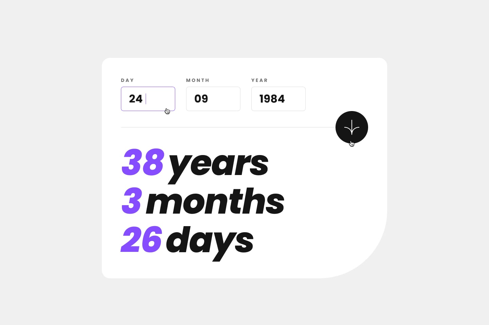

# Screenshots of the app

The design is very simple, which makes it easier to overview and navigate through the app:

|                       Example Values            |     Design while launch                           | Required fields are empty | Values are invalid | Mobile Version |
| :---------------------------------------------: |   :---------------------------------------------: | :---------------------------------------------:   | :---------------------------------------------:   | :---------------------------------------------: |
|<a> | <a> | <a> | <a>        | <a> |